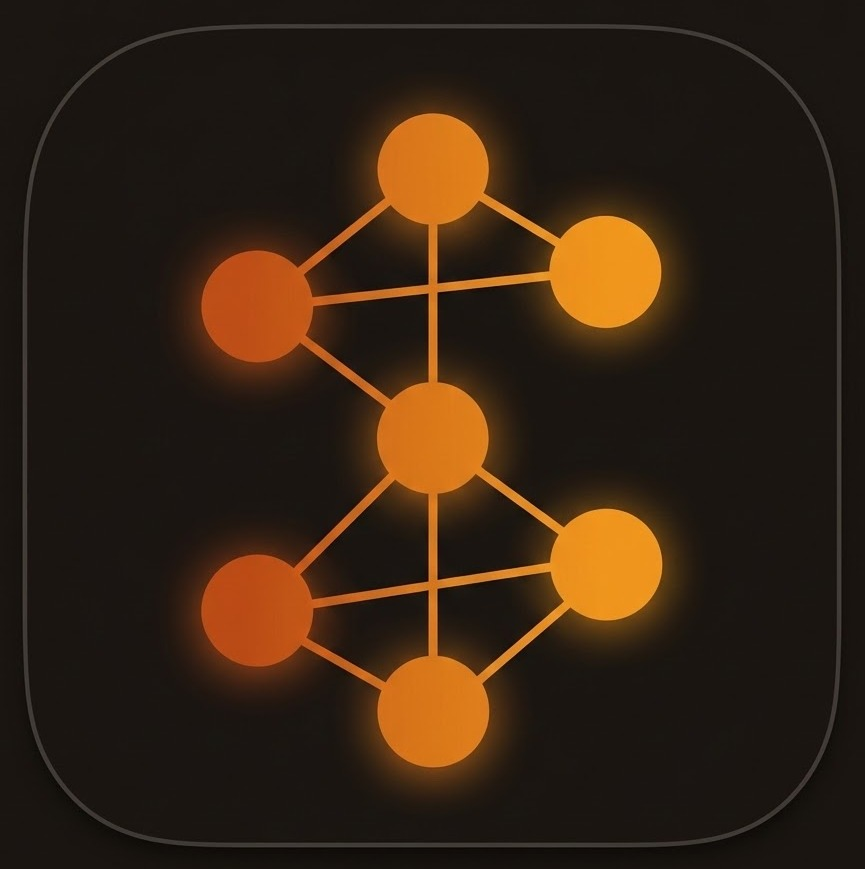
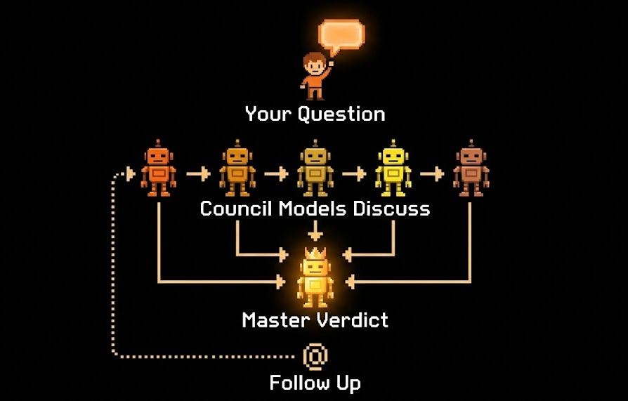
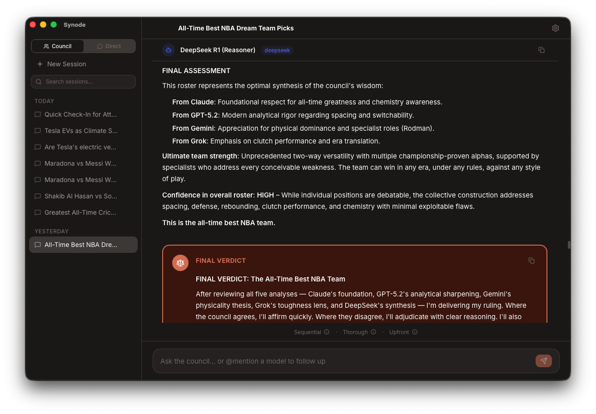

<p align="center">
  
</p>

<h1 align="center">Synode</h1>

<p align="center">
  <strong>A council of AI models, one definitive verdict.</strong>
</p>

<p align="center">
  <a href="LICENSE"></a>
  
  
  
  
</p>

---

Synode is a desktop app for **macOS and Windows** that assembles a **council of AI models** to collaboratively tackle your questions. Multiple models from different providers discuss the topic - either sequentially (building on each other) or independently (preventing groupthink) - then a **master model** synthesizes everything into a clear, actionable verdict. You can also switch to **Direct Chat** mode for 1-on-1 conversations with any individual model.

## How It Works


You ask a question, and your council of AI models responds. In **Sequential** mode (as shown above), each model sees the full discussion so far, responding one by one. In **Independent** mode, each model only sees your original question and responds **in parallel** for faster results and unbiased perspectives. Once everyone has weighed in, a master model synthesizes all perspectives into a clear, actionable verdict. After the verdict, @mention any model to ask follow-up questions with full context.

## Features

### Two Modes
- **Council Mode** — assemble a panel of AI models for collaborative discussion and a synthesized verdict
- **Direct Chat** — 1-on-1 conversations with any of 29 models across 8 providers, with multi-turn history and streaming

### Council Discussion
- **8 providers, 29 models** — Anthropic, OpenAI, Google, xAI, DeepSeek, Mistral, Together AI, and Cohere
- **Discussion styles** — Sequential (each model builds on previous responses) or Independent (each model responds without seeing others, preventing groupthink)
- **Parallel execution** — In Independent mode, models 1..N stream their responses simultaneously for faster results, with a real-time Council Progress overlay tracking each model's status
- **Master verdict** — a designated model synthesizes all opinions into a final recommendation

### Direct Chat
- **Agent picker** — searchable grid of all available models, sorted by API key availability
- **Multi-turn conversations** — full conversation history with streaming responses
- **Auto-save** — sessions are saved after every response with AI-generated titles
- **Provider color coding** — each model is visually identified by its provider

### Follow-Up @Mentions 
- After the verdict, type **`@`** to mention any council member or the master model
- Ask follow-up questions with **full discussion context** — the model sees every response, not just its own
- Cross-reference freely: *"@Grok what do you think about GPT's suggestion?"*
- Chain unlimited follow-ups within the same session

### Smart Prompt Engineering 
- **Upfront mode** — master generates tailored system prompts for all council members before the discussion starts
- **Dynamic mode** — master generates a custom prompt for each model right before its turn, incorporating context from previous responses

### Discussion Depth 
- **Thorough** — detailed analysis with comprehensive reasoning
- **Concise** — 2-3 key points per model, optimized for speed and cost
- Active settings are always visible in the chat view with (i) tooltips explaining each option

### Session Management
- Auto-save after every response — never lose a discussion
- AI-generated session titles
- Searchable history grouped by date
- Custom storage location

### Token Usage & Cost Tracking 
- Per-model input/output token counts
- **Estimated USD cost** per model and grand total, powered by [tokentally](https://github.com/steipete/tokentally) with static pricing for all 29 models
- Dedicated **Usage tab** in Settings — separates read-only analytics from editable model configuration
- Summary stat cards showing total tokens, total cost, and models used at a glance

> **Note:** These features are already merged into `main` and available if you [build from source](#run). They will be included in the next release (v0.4.3).

### Telegram Bot Integration
- **Built-in Telegram bot** — chat with Synode from any device
- **Council and Direct Chat** — both modes available via `/council` and `/chat` commands
- **Shared config** — uses the same API keys, models, and settings as the desktop app
- **Auto-start** — bot launches with the app when enabled in Settings
- See [Telegram Bot docs](docs/TELEGRAM_BOT.md) for setup instructions

### Internet Access (Web Search) 
- **Live web search** — models can search the web for up-to-date information when answering
- **4 supported providers** — Anthropic (`web_search` tool), Google (`google_search` grounding), OpenAI (Responses API), xAI (Responses API, Grok-4 only)
- **Automatic model filtering** — unsupported providers (DeepSeek, Mistral, Together AI, Cohere) are excluded from council when internet is enabled, with amber warnings showing which models are skipped
- **Globe toggle** — enable/disable from the chat input area or Advanced Settings
- **Smart prompting** — system prompt nudge instructs models to actively use their search tools

> **Note:** These features are already merged into `main` and available if you [build from source](#run). They will be included in the next release (v0.4.3).

### Polished UX
- **Real-time streaming** with 4 animated cursor styles (ripple, breathing, orbit, multi-caret)
- **Dark mode** support
- **Drag-and-drop** model reordering
- **Secure API key storage** — macOS Keychain or Windows Credential Manager
- **Setup wizard** with built-in API key instructions for each provider
- **External links** — URLs in model responses open in the system default browser

## Screenshots

<p align="center">
  
</p>
<p align="center"><em>Many models, one verdict — watch your council think through the problem, then @mention anyone to keep talking</em></p>

<p align="center">
  
</p>
<p align="center"><em>Direct Chat — pick any model for a 1-on-1 conversation, with all 29 models at your fingertips</em></p>

<p align="center">
  
</p>
<p align="center"><em>Configure your council — choose from 8 providers, 30+ models, with API keys secured in your OS credential store</em></p>

<p align="center">
  
</p>
<p align="center"><em>Control your council with prompt engineering modes</em></p>

### Demo

▶️ [Watch the demo video](https://youtu.be/BvqSjLuyTaA?si=UF8waoQEv-GQ2JNj) *(recorded on an earlier version)*

## Supported Providers

| Provider | Models | Web Search |
|----------|--------|:----------:|
| **Anthropic** | Claude Opus 4.6, Sonnet 4.6, Sonnet 4.5, Haiku 4.5 | ✅ |
| **OpenAI** | GPT-5.2, GPT-4.1, GPT-4.1 Mini, GPT-4.1 Nano, GPT-4o, GPT-4o Mini, o3, o3-mini, o4-mini | ✅* |
| **Google** | Gemini 2.5 Pro, Gemini 2.5 Flash, Gemini 2.5 Flash Lite | ✅ |
| **xAI** | Grok-4, Grok-3, Grok-3 Mini | ✅** |
| **DeepSeek** | DeepSeek V3 (Chat), DeepSeek R1 (Reasoner) | — |
| **Mistral** | Mistral Large, Mistral Medium, Mistral Small, Codestral | — |
| **Together AI** | Llama 4 Maverick, Llama 4 Scout | — |
| **Cohere** | Command A, Command R+ | — |

\* OpenAI: all models except GPT-4.1 Nano and o3-mini &nbsp;&nbsp; \** xAI: Grok-4 family only

> Bring your own API keys. Each key is stored locally in the OS credential store (macOS Keychain or Windows Credential Manager) — never sent anywhere except the provider's own API.

## Quick Start

### Prerequisites

- **macOS** 10.15+ or **Windows** 10+
- **Rust** 1.77+ &mdash; [install via rustup](https://rustup.rs/)
- **Node.js** 18+ &mdash; [download](https://nodejs.org/)
- **Tauri CLI** v2 &mdash; `cargo install tauri-cli --version "^2"`

### Run

```bash
git clone https://github.com/mahatab/Council-of-AI-Agents.git
cd Council-of-AI-Agents
npm install
cargo tauri dev
```

A setup wizard will guide you through configuring your council models, master model, and API keys on first launch.
## Building

```bash
cargo tauri build
```

**macOS** — produces `src-tauri/target/release/bundle/macos/Synode.app` and `.dmg`

**Windows** — produces `src-tauri/target/release/bundle/nsis/Synode_x.x.x_x64-setup.exe` and `.msi`

## Architecture

```
Cargo.toml                    Workspace root
├── src-tauri/                Tauri desktop app (Rust backend)
│   ├── commands/             stream_chat, keychain, sessions, settings, telegram
│   └── lib.rs                App setup, bot auto-start
├── crates/council-core/      Shared library
│   ├── providers/            8 AI provider integrations with SSE streaming
│   ├── models/               Config, session, discussion entry types
│   ├── keychain/             macOS Keychain / Windows Credential Manager
│   ├── sessions.rs           Session storage
│   └── settings.rs           Settings persistence
├── crates/telegram-bot/      Telegram bot (embedded + standalone)
│   ├── council.rs            Council orchestration for Telegram
│   ├── direct_chat.rs        1-on-1 chat with any model
│   ├── handlers.rs           8 slash commands + message routing
│   └── formatting.rs         Markdown-to-Telegram-HTML converter
└── src/                      React + TypeScript frontend
    ├── components/
    │   ├── chat/             ChatView, DirectChatView, AgentPicker,
    │   │                     ModelResponse, MasterVerdict, MentionDropdown,
    │   │                     FollowUpQuestion, ClarifyingQuestion,
    │   │                     ParallelStatusOverlay, StreamingText
    │   ├── settings/         Models, API Keys, Appearance, Sessions, Usage, Telegram
    │   ├── setup/            First-run wizard
    │   └── common/           Button, Toggle, Modal
    ├── stores/               Zustand stores (council, directChat, settings, session)
    ├── lib/                  Tauri IPC bindings, theme, markdown, sessionTitle, pricing
    └── types/                TypeScript definitions
```

### Tech Stack

| Layer | Technology |
|-------|-----------|
| Desktop framework | Tauri v2 (Rust + native WebView) |
| Frontend | React 19, TypeScript 5.9 |
| Styling | Tailwind CSS v4 |
| State management | Zustand |
| Animations | Framer Motion |
| Drag-and-drop | dnd-kit |
| Markdown | react-markdown + react-syntax-highlighter |
| External links | tauri-plugin-opener (system default browser) |
| API key storage | macOS Keychain / Windows Credential Manager |
| HTTP streaming | reqwest + tokio-stream with SSE line buffering |

## Documentation

Detailed docs live in the [`docs/`](docs/) directory:

- [Architecture](docs/ARCHITECTURE.md) — system design, state machine, streaming pipeline
- [API Providers](docs/API_PROVIDERS.md) — endpoints, auth methods, streaming formats
- [Adding Providers](docs/ADDING_PROVIDERS.md) — step-by-step guide to add new AI providers
- [Setup Guide](docs/SETUP_GUIDE.md) — installation and configuration walkthrough
- [Telegram Bot](docs/TELEGRAM_BOT.md) — setup, commands, standalone deployment

## Contributing

Contributions are welcome! See [CONTRIBUTING.md](CONTRIBUTING.md) for development setup, code style, and PR guidelines.

## License

MIT &mdash; see [LICENSE](LICENSE) for details.
